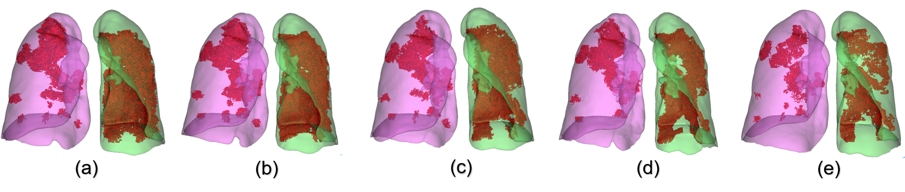

# COVID-19
We aim to leverage the power of machine learning methods, especially deep learning, to automatically visualize, quantify and assess lung infection of COVID-19 using chest Computational Tomography (CT) images. We present some preliminary results as follows to show what kind of results we are working on. 

:--:
*Segmentatin of CT images of a patient infected by covid-19. (a): the CT images are delineated into 4 regions, with the infected region colored in red; (b): more regions are delineated in order to provide a better and more detailed quantification. RUL, RML, RLL, LUL and LLL denote right upper lobe, right middle lobe, right lower lobe, left upper lobe and left lower lobe.* 

*Dyanmically visualise the changes of covid-19 infection. (a): segmentation on 25/02/2020  (b): 29/02/2020 (c): 04/03/2020 (d): 09/03/2020 (e): 13/03/2020*

# Background 
Chest CT examination has also shown its effectiveness in follow-up assessment of hospitalized COVID-19 patients. Due to fast progression of the disease, subsequent CT scans every 3-5 days are recommended to evaluate the therapeutic responses. Although CT provides rich pathological information, only qualitative evaluation has been provided in the radiological reports owing to the lack of computerized tools to accurately quantify the infection regions and their longitudinal changes. Thus, subtle changes across follow-up CT scans are often ignored. Besides, contouring infection regions in the Chest CT is necessary for quantitative assessment; however, manual contouring of lung lesions is a tedious and time-consuming work, and inconsistent delineation could also lead to subsequent assessment discrepancies. Thus, a fast auto-contouring tool for COVID-19 infection is urgently needed in the onsite applications for quantitative disease assessment.

# Our aim
We aim to develope a deep learning (DL)-based segmentation system for quantitative infection assessment. The system not only performs auto-contouring of infection regions, but also accurately estimates their shapes, volumes and percentage of infection (POI) in CT scans of COVID-19 patients. In order to provide delineation for hundreds of the training COVID-19 CT images, which is a tedious and time consuming work, we propose a human-in-the-loop (HITL) strategy to iteratively generate the training samples. This method involves radiologists to efficiently intervene DL-segmentation results and iteratively add more training samples to update the model, and thus greatly accelerates the algorithm development cycle. In the end, we would like the system to visualise, quantify and assess COVID-19 from CT images accurately and robustly. 

